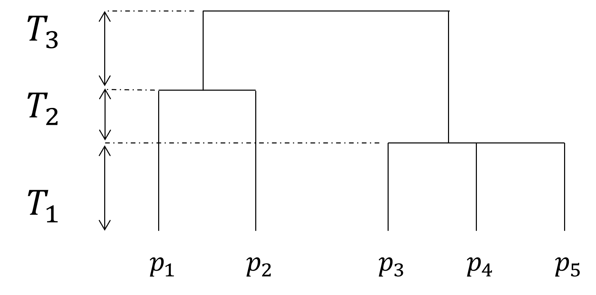

```{r}
#| label: DoNotModify
#| include: false
### Utilities. Do not modify.
# Installation of packages if necessary
InstallPackages <- function(Packages) {
  InstallPackage <- function(Package) {
    if (!Package %in% installed.packages()[, 1]) {
      install.packages(Package, repos = "https://cran.rstudio.com/")
    }
  }
  invisible(sapply(Packages, InstallPackage))
}

# Basic packages
InstallPackages(c("bookdown", "formatR", "kableExtra", "ragg"))

# Chunk font size hook: allows size='small' or any valid Latex font size in chunk options
def.chunk.hook  <- knitr::knit_hooks$get("chunk")
knitr::knit_hooks$set(chunk = function(x, options) {
  x <- def.chunk.hook(x, options)
  ifelse(options$size != "normalsize", paste0("\n \\", options$size,"\n\n", x, "\n\n \\normalsize"), x)
})
```

```{r}
#| label: Options
#| include: false
### Customized options for this document
# Add necessary packages here
Packages <- c("tidyverse", "entropart")
# Install them
InstallPackages(Packages)

# knitr options
knitr::opts_chunk$set(
  cache =   TRUE,     # Cache chunk results
  include = TRUE,     # Show/Hide chunks
  echo =    FALSE,    # Show/Hide code
  warning = FALSE,    # Show/Hide warnings
  message = FALSE,    # Show/Hide messages
  # Figure alignment and size
  fig.align = 'center', out.width = '100%',
  # Graphic devices (ragg_png is better than standard png)
  dev = c("ragg_png", "pdf"),
  # Code chunk format
  tidy = TRUE, tidy.opts = list(blank = FALSE, width.cutoff = 50),
  size = "scriptsize", knitr.graphics.auto_pdf = TRUE
)
options(width = 50)

# ggplot style
library("tidyverse")
theme_set(theme_bw())
theme_update(
  panel.background = element_rect(fill = "transparent", colour = NA),
  plot.background = element_rect(fill = "transparent", colour = NA)
)
knitr::opts_chunk$set(dev.args = list(bg = "transparent"))

# Tibbles: 5 lines, fit to slide width
options(tibble.print_min = 5, tibble.width = 50)

# Random seed
set.seed(973)
```


# Motivation

## Facettes de la biodiversité

```{r}

```

Figure de @Swenson2011a. 
Dépasser la seule richesse spécifique.

# Diversité taxonomique

## Formalisation

On connaît la probabilité qu'un individu appartienne à une espèce particulière : $p_s$.

L'information $I(p_s)$ est la surprise apportée par l'observation de l'espèce $s$. 
Elle est strictement décroissante et $I(1)=0$.

L'entropie est l'espérance de l'information apportée par une observation [@Maasoumi1993].


## Entropie de Shannon

L'inverse de la probabilité $p_s$ est appelé *rareté* de l'espèce $s$

L'information de Shannon est $\ln(1/p_s)$

$\implies$ L'information de Shannon est le logarithme de la rareté.

L'entropie de @Shannon1948 est la moyenne de l'information apportée par tous les individus :

$$
  H = \sum^S_{s=1}{p_s\log{\frac{1}{p_s}}}
$$

## Généralisation

Modification de la fonction d'information :
logarithme déformé d'ordre $q$ [@Tsallis1994] : $\ln_q x = \frac{x^{1-q} -1}{1-q}$

```{r lnq, out.width='80%'}
library("entropart")
curve(log(1/x), 0, 1, lty=1, lwd=2, ylab = expression(ln[q](1/x)))
curve(lnq(1/x, 0), 0, 1, lwd=2, lty = 2, add = TRUE)
curve(lnq(1/x, 2), 0, 1, lwd=2, lty = 3, add = TRUE)
legend("topright", 
      legend = c(expression(ln[0](1/x)), "ln(1/x)",
      expression(ln[2](1/x))),
      lty = c(2, 1, 3, 4), inset=  0.02)
```


## Entropie HCDT 

L'entropie HCDT [@Havrda1967;@Daroczy1970;@Tsallis1988] d'ordre q est la moyenne du logarithme déformé de la rareté :

$$^{q}H = \sum_s{p_s ln_q{(1/p_s)}}$$

Elle généralise les mesures traditionnelles :

- $^{0}H$ est le nombre d'espèces moins 1
- $^{1}H$ est l'indice de Shannon
- $^{2}H$ est l'indice de Simpson

Elle permet de choisir l'importance des espèces rares.

## Nombres de Hill

@Hurlbert1971 publie *The Nonconcept of Species Diversity: A Critique and Alternative Parameters* : l'entropie est peu intuitive.

@Hill1973 introduit les nombres effectifs (devenus Nombres de Hill) :

- nombres d'espèces équiprobables ayant la même entropie que les données [concept de @Wright1931]


## Nombres de Hill

Le nombres de Hill d'ordre $q$ est l'exponentielle déformée de l'entropie [@Marcon2014a] :
$$e^x_q = [1 + (1 - q)x]^{\frac{1}{1-q}}.$$

C'est la définition de la diversité au sens strict [@Jost2006]

$$^{q}D = e_q^{^{q}H}$$

C'est un *nombre effectif* d'espèces [@Gregorius1991].


## Profils de Diversité

```{r, out.width='80%'}
# Lecture des données
read.csv2("data/Paracou6.csv") %>% 
  group_by(spName) %>% 
  summarize(Abondance = n()) %>% 
  pull(Abondance) %>% 
  as.AbdVector() ->
  p6_abd
```

```{r, out.width='80%'}
CommunityProfile(Diversity, p6_abd) %>% 
  autoplot()
```

Profils de diversité des arbres de la parcelle 6 de Paracou


# Extensions

## Diversité phylogénétique

```{r}

```

L'entropie est calculée à chaque période de l'arbre, et moyennée.

La diversité est son exponentielle [@Marcon2014b].


## Diversité fonctionnelle


```{r, out.width='80%'}

```

Figure de @Tilman2001a.
La similarité entre espèces définit à quel point deux espèces sont fonctionnellement proches : nécessite de définir une matrice de similarité $\mathbf{Z}$.

## Diversité fonctionnelle

La banalité d'une espèce est la similarité moyenne de ses représentants avec les autres individus [@Leinster2012] : $\mathbf{Zp}$

La rareté est l'inverse de la banalité : $1/\mathbf{Zp}_s$

Le reste des définitions est inchangé.


# Estimation

## Accumulation

```{r, out.width='80%'}
# Courbe d'accumulation
p6_abd %>% 
  DivAC(q=0, n.seq=seq_len(1.5*sum(.)), NumberOfSimulations = 0) %>% 
  autoplot()
```

Raréfaction exacte, extrapolation estimée.


## Diversité asymptotique

Diversité de la communauté entière, dont on aurait inventorié tous les individus.

En forêt tropicale : convention.

Diversité asymptotique estimée de Paracou, parcelle 6 : `r entropart::Richness(p6_abd)` espèces.


# Conclusion

## Avantages

Théorie complète et robuste pour unifier la mesure de la biodiversité d'un taxon ou d'un groupe biologique (les arbres).

Mémorisation simple :

- l'information est le logarithme de la rareté,
- l'entropie est l'espérance de l'information,
- la diversité est l'exponentielle de l'entropie.

Synthèse : https://github.com/EricMarcon/MesuresBioDiv2

Outils mathématiques (estimateurs) disponibles dans deux package R : *entropart* [@Marcon2014c] et iNEXT.3D [@Chao2021].


## Limites

Ne prend en compte qu'un groupe biologique.

Pas de théorie sur la composition des mesures (ex.: diversité des arbres et des papillons)

Nécessite beaucoup de données, peu utilisable à grande échelle.


<!-- A slide for references --> 
`r if (!knitr:::is_latex_output()) '## References {.smaller}'`
<!-- Styles for HTML slides -->
<!-- https://stackoverflow.com/questions/38260799/references-page-truncated-in-rmarkdown-ioslides-presentation/38294541#38294541 -->
<style>
  .forceBreak { -webkit-column-break-after: always; break-after: column; }
  slides > slide { overflow: scroll; }
  slides > slide:not(.nobackground):after { content: ''; }
</style>
